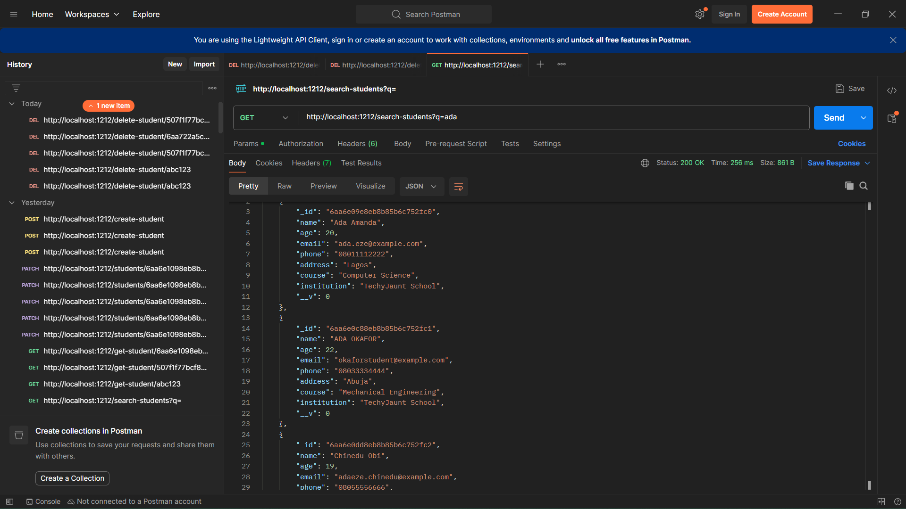
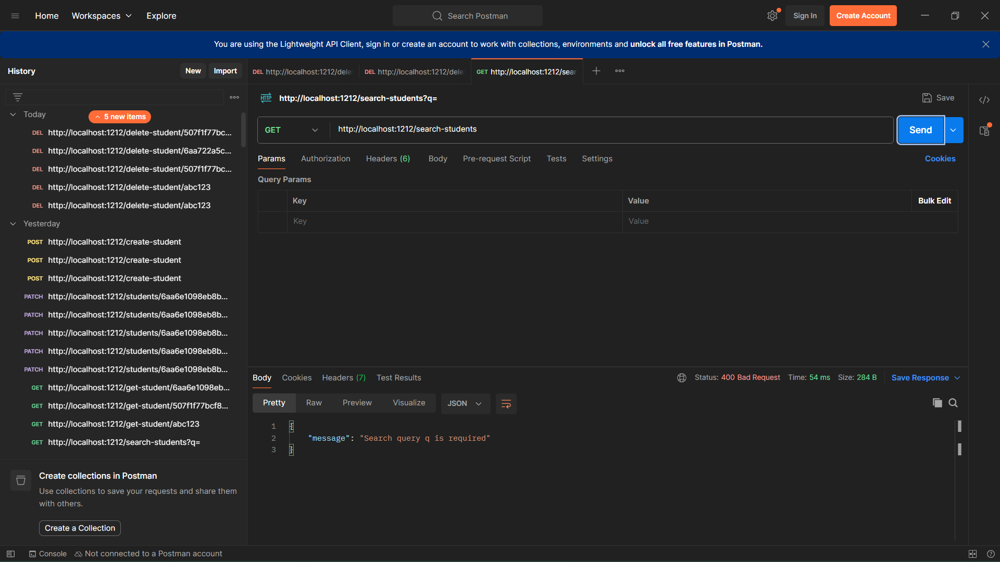
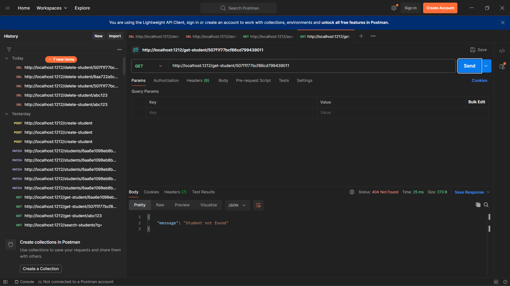
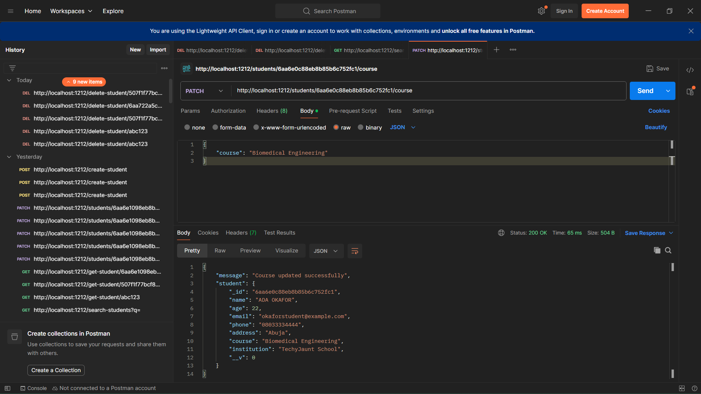
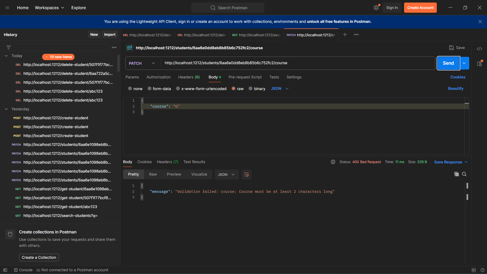
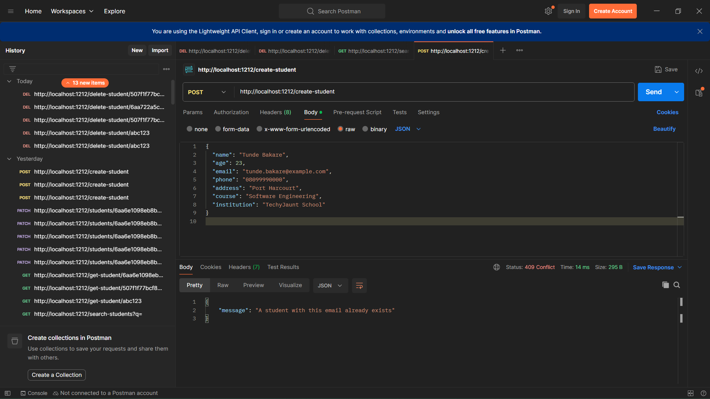

# Part C — Prove it (testing)

### Test 1 — Search finds multiple case-insensitive matches
`GET /search-students?q=ada` returns all students whose name, email, or course contains "ada", regardless of case.

### Test 2 — Search with no q
`GET /search-students` with no query parameter returns 400 instead of the whole database.

### Test 3 — Get student with invalid ID
`GET /get-student/abc123` returns 400, not a 500 crash.

### Test 4 — Get student with valid but nonexistent ID
`GET /get-student/507f1f77bcf86cd799439011` returns 404, not 200 with a null student.

### Test 5 — Patch course on a real student
`PATCH /students/:id/course` with `{ "course": "Physics" }` returns 200, and the response body shows the updated course.

### Test 6 — Patch with too-short course
`PATCH /students/:id/course` with `{ "course": "A" }` is rejected by schema validation with 400, not a 500 crash.

### Test 7 — Duplicate email on create
Creating a second student with an email that already exists returns 409 Conflict.

### Test 8 — Delete a nonexistent ID
`DELETE /delete-student/507f1f77bcf86cd799439011` returns 404, not a false "deleted successfully" message.

